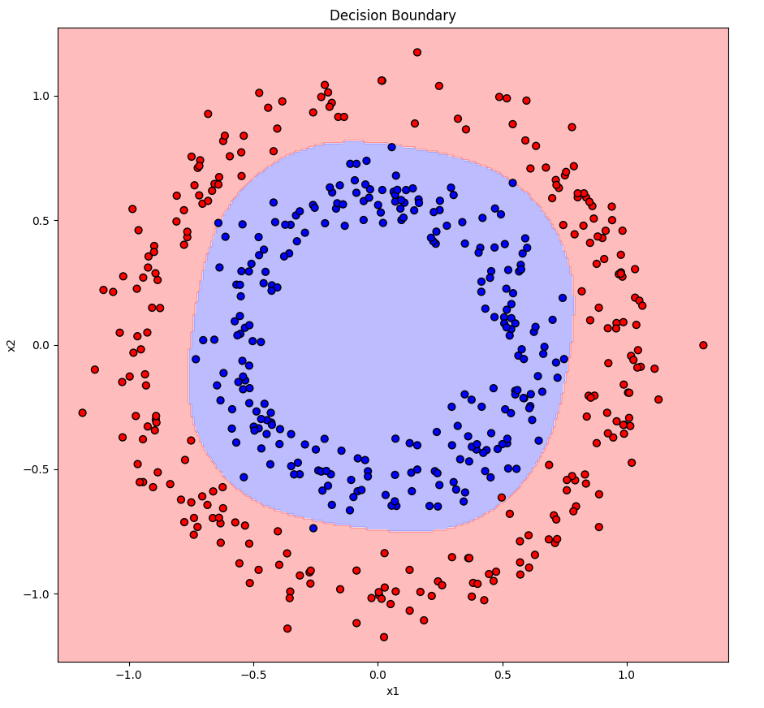
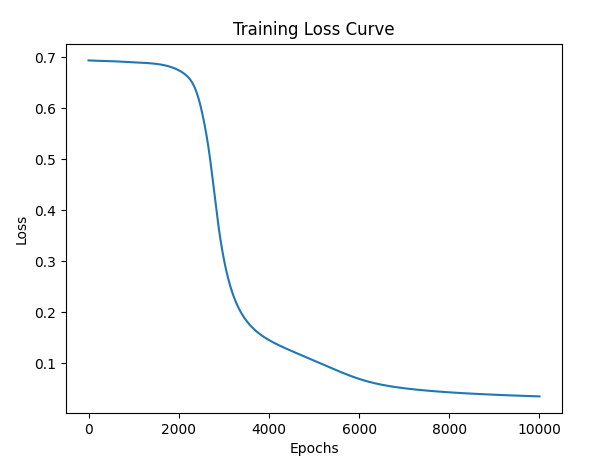

# Circle Classification Neural Network (NumPy From Scratch)

A fully from-scratch **2-layer neural network** built using only **NumPy** to classify points in a 2D plane based on whether they fall *inside* or *outside* a circle. This project is a practical extension of manual neural network fundamentals: forward pass, backpropagation, binary classification, and decision boundary visualization.

---

## Problem Description

We classify 2D points into two classes:

* **Class 0:** Inside a small circle (inner region)
* **Class 1:** Outside the circle (outer ring)

This dataset is non-linear, making it ideal for testing simple neural networks.

---

## Project Structure

```
circle-classifier/
│── data/            # Optional folder for saved/generated points
│── nn_numpy.py      # Neural network class (forward + backward pass)
│── train.py         # Training loop + decision boundary plotting
│── utils.py         # Helpers (data generation, plotting utils)
└── README.md
```

---

## Features

* Pure NumPy implementation
* Custom 2-layer feedforward neural network
* Sigmoid activation for binary classification
* Manual backpropagation
* Gradient descent optimizer
* Visualizes decision boundary

---

## How to Run

### 1. Install Dependencies

```bash
pip install numpy matplotlib
```

### 2. Train the Model

```bash
python train.py
```

During training, the script will:

* Generate circle dataset
* Train the neural network
* Plot the evolving decision boundary

---

## Neural Network Architecture

* **Input Layer:** 2D point (x, y)
* **Hidden Layer:** Typically 3–8 neurons (sigmoid)
* **Output Layer:** 1 neuron (sigmoid)
* **Loss:** Binary Cross-Entropy (or MSE depending on your implementation)
* **Optimizer:** Gradient descent

---

## Visualizations

The training script includes:

* Scatter plot of classification results
* Decision boundary contour plot that updates during/after training

These visuals help understand how the network learns non-linear boundaries.

---


